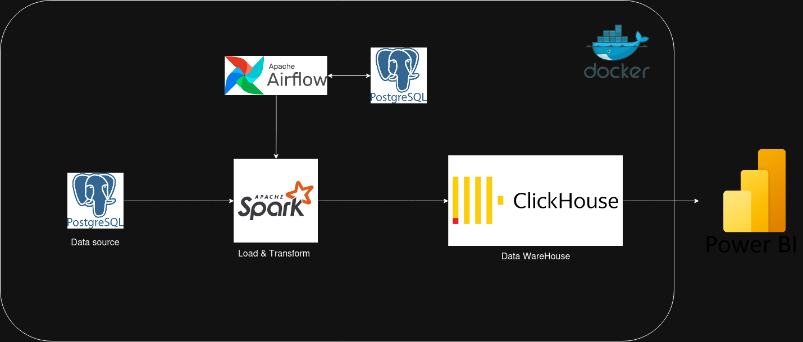
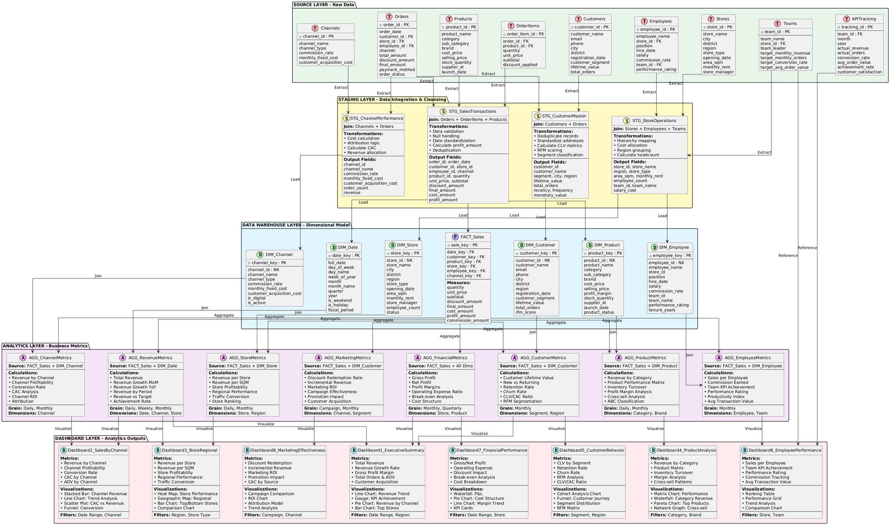
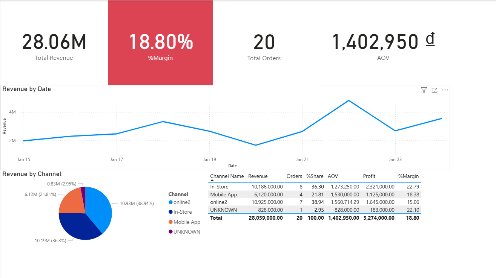
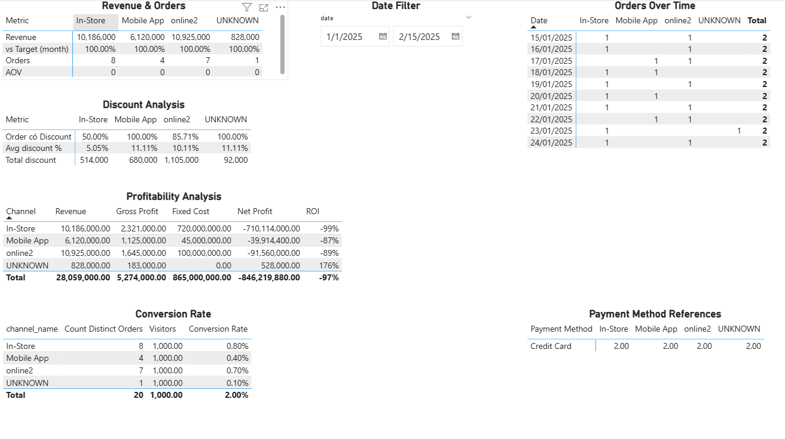

# Retail Data Pipeline with Astro Airflow and Spark run on Docker

Project Description
=======
Deploy a simple data pipeline with astro + airflow and spark on docker locally.   
Data in this project is mainly focus on a Electronic Retail Brand named Techo with 3 main selling channel include: Online, In Store, Mobile  
The data source come from a Postgres Backend DataBase, extract and transform using pySpark then load to ClickHouse as a DataWarehouse  
Data visualization by using Power BI  

System Architecture:
 

Data flow and schema structure: Using star schema for Data Model in Datawarehouse and SCD type 2 to store history of dimension tables  
Currently I have only completed part of the data schema below including tables: product, channel, sale, the rest will be updated later.
 

Airflow is used to orch

Dashboard:
<b>Over view</b> 

<b>Channel Performance</b>

How to Install and Run the Project
==================================
Prerequisites:   
- Python 3.11  
- Docker Engine, Compose   
- Astronomer CLI [You can follow the instruction here](https://www.astronomer.io/docs/astro/cli/install-cli)  
- ClickHouse ODBC [Follow the link to download , or use the compressed file in ./Clickhouse_odbc folder to get Windows Installer file](https://github.com/ClickHouse/clickhouse-odbc) 

After install all those requirements above, clone the source code

git clone https://github.com/tuanttdev/astro_airflow_spark_retail_pipeline.git

Change direction to astro_airflow_spark_retail_pipeline folder   

cd astro_airflow_spark_retail_pipeline  

1. Start Airflow on your local machine by running 'astro dev start'.

This command will spin up 4 Docker containers on your machine, each for a different Airflow component:

- Postgres: Airflow's Metadata Database
- Webserver: The Airflow component responsible for rendering the Airflow UI
- Scheduler: The Airflow component responsible for monitoring and triggering tasks
- Triggerer: The Airflow component responsible for triggering deferred tasks

And plus 4 Docker containers: 

- Postgres: The database store source data 
- ClikHouse: DataWarehouse for storing destination data
- Spark Master: 
- Spark Worker: 

2. Verify that all 8 Docker containers were created by running 'docker ps'.

Note: Running 'astro dev start' will start your project with the Airflow Webserver exposed at port 8080 and Postgres exposed at port 5432. If you already have either of those ports allocated, you can either [stop your existing Docker containers or change the port](https://www.astronomer.io/docs/astro/cli/troubleshoot-locally#ports-are-not-available-for-my-local-airflow-webserver).

Because Airflow Webserver exposed at port 8080, Spark master will be exposed at port 8081, 8082 for Spark worker, and 5433 for Postgres Database source system

3. Access the Airflow UI for your local Airflow project. To do so, go to http://localhost:8080/ and log in with 'admin' for both your Username and Password.

You should also be able to access your Postgres Database at 'localhost:5432/postgres'.

4. Config PowerBI to connect to ClickHouse server 

    
 <b>You can read the below instruction from Astronomer for more information</b> 

    
Overview
========

Welcome to Astronomer! This project was generated after you ran 'astro dev init' using the Astronomer CLI. This readme describes the contents of the project, as well as how to run Apache Airflow on your local machine.

Project Contents
================

Your Astro project contains the following files and folders:

- dags: This folder contains the Python files for your Airflow DAGs. By default, this directory includes one example DAG:
    - `example_astronauts`: This DAG shows a simple ETL pipeline example that queries the list of astronauts currently in space from the Open Notify API and prints a statement for each astronaut. The DAG uses the TaskFlow API to define tasks in Python, and dynamic task mapping to dynamically print a statement for each astronaut. For more on how this DAG works, see our [Getting started tutorial](https://www.astronomer.io/docs/learn/get-started-with-airflow).
  - Dockerfile: This file contains a versioned Astro Runtime Docker image that provides a differentiated Airflow experience. If you want to execute other commands or overrides at runtime, specify them here.
  - include: This folder contains any additional files that you want to include as part of your project. It is empty by default.
  - packages.txt: Install OS-level packages needed for your project by adding them to this file. It is empty by default.
  - requirements.txt: Install Python packages needed for your project by adding them to this file. It is empty by default.
  - plugins: Add custom or community plugins for your project to this file. It is empty by default.
  - airflow_settings.yaml: Use this local-only file to specify Airflow Connections, Variables, and Pools instead of entering them in the Airflow UI as you develop DAGs in this project.

Deploy Your Project Locally
===========================

1. Start Airflow on your local machine by running 'astro dev start'.

This command will spin up 4 Docker containers on your machine, each for a different Airflow component:

- Postgres: Airflow's Metadata Database
  - Webserver: The Airflow component responsible for rendering the Airflow UI
  - Scheduler: The Airflow component responsible for monitoring and triggering tasks
  - Triggerer: The Airflow component responsible for triggering deferred tasks

  2. Verify that all 4 Docker containers were created by running 'docker ps'.

Note: Running 'astro dev start' will start your project with the Airflow Webserver exposed at port 8080 and Postgres exposed at port 5432. If you already have either of those ports allocated, you can either [stop your existing Docker containers or change the port](https://www.astronomer.io/docs/astro/cli/troubleshoot-locally#ports-are-not-available-for-my-local-airflow-webserver).

3. Access the Airflow UI for your local Airflow project. To do so, go to http://localhost:8080/ and log in with 'admin' for both your Username and Password.

You should also be able to access your Postgres Database at 'localhost:5432/postgres'.

Deploy Your Project to Astronomer
=================================

If you have an Astronomer account, pushing code to a Deployment on Astronomer is simple. For deploying instructions, refer to Astronomer documentation: https://www.astronomer.io/docs/astro/deploy-code/

Contact
=======

The Astronomer CLI is maintained with love by the Astronomer team. To report a bug or suggest a change, reach out to our support.

